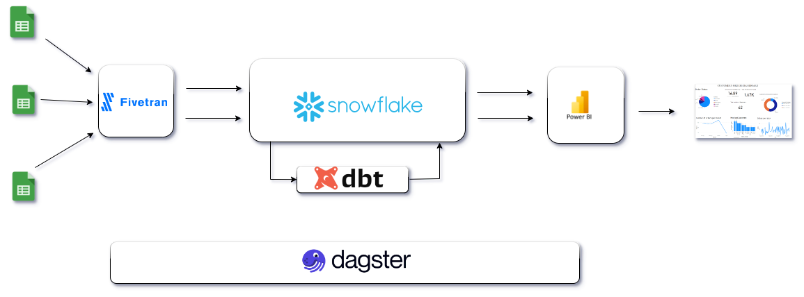
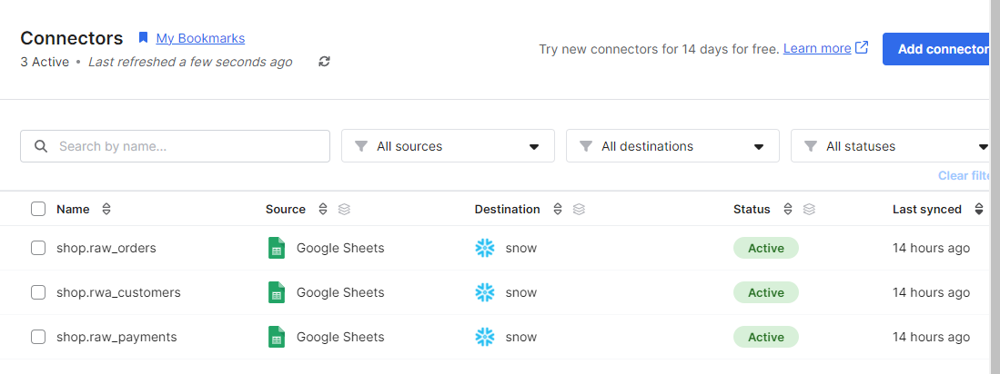
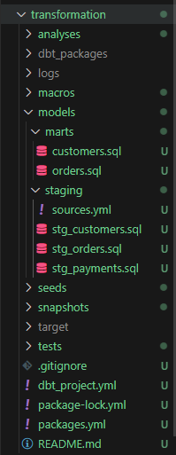
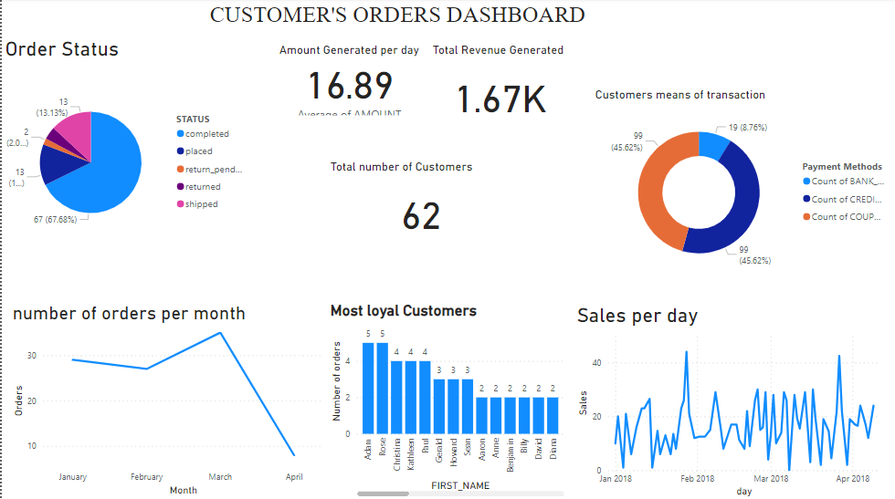

# End-to-end-data-pipeline-project

# Overview:
This repository contained the code and documentation for a data pipeline project that involved ingesting data from Google Sheets into Snowflake using Fivetran, performing data transformations with dbt, orchestrating the pipeline with Dagster, and visualizing and analyzing the data using Power BI. The data used in the project comprised three csv from a fiticious online shop

# Project Goal:
The goal of this data pipeline project is to facilitate the seamless extraction, transformation, and analysis of data from Google Sheets pertaining to a shop's operations. By orchestrating various tools such as Fivetran, dbt, Dagster, and Power BI, the pipeline aims to achieve the following objectives:

## Data Integration: 

Data was ingested from multiple sources within Google Sheets which including customer information, order details, and payment transactions into Snowflake data warehouse. tdataset was set to full refresh at specific intervals. Below is a picture showing fivetran sync from google sheet to snowflake warehouse.

## Data Transformation: 
Data transformations was performed using dbt to ensure that the raw data is cleaned, structured, and prepared for downstream analysis. This includes tasks such as data cleansing, normalization and aggregation to derive actionable insights. Below is a picture showing the file structure of transformation folder which shows how dbt transformations was performed.

## Data Orchestration: 
Dagster was used to orchestrate the entire data pipeline, ensuring that each stage of the process is executed in a reliable, scalable, and maintainable manner. This involves managing dependencies between tasks, handling errors, and monitoring pipeline performance. Fivetran sync was integrated into dagster's software defined asset through it's API keys and dagster asset. dbt on the other hand was incoporated into dagster with dbt asset. dagster authoritatively ochestrate actitivities of each asset systematically when the materialize button is activated. Below is a picture showing dagster's asset lineage.

## Visualization and Analysis: 
Power BI was used in oder to enable stakeholders to visualize and analyze the transformed data in order to facilitate data-driven decision-making. This includes creating interactive dashboards, reports, and visualizations to explore trends, patterns, and key performance indicators related to the shop's operations. Below is a picture showing a dashboard created after analysis in Power BI.

### Folder Structure:

transformation: Includes dbt files and folders for transforming data within the data warehouse.
Orchestration: Contains scripts and folders defining the Dagster pipeline and its components.
other files:

# Usage:
Setup Fivetran: Configure Fivetran to connect to the Google Sheets document(s) and replicate data into Snowflake.

Run dbt Transformations:
 Execute dbt models to transform the ingested data within Snowflake.
Orchestrate Pipeline with Dagster: Define and execute the Dagster pipeline to coordinate the data flow between different stages of the pipeline.

Visualize and Analyze with Power BI: Connect Power BI to Snowflake to access the transformed data and design interactive dashboards and reports.

## Dependencies:
Fivetran account and configuration.
Snowflake account for data storage and transformation.
dbt installation for data transformations.
Dagster installation for data orchestration.
Power BI Desktop or Power BI Pro for visualization and analysis.

## Notes:
To ensure that proper access controls and permissions are set up for data security,
monitoring the pipeline regularly for any issues or discrepancies is very important.
